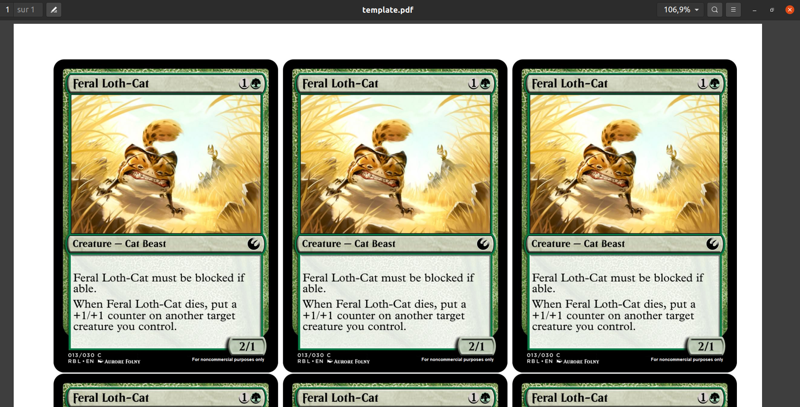

# A simple LaTeX template to print Magic: the Gathering cards as PDF

This LaTeX template can be used to print proxies of Magic: The Gathering cards.
The cards have dimensions of exactly 63mm x 88mm.

Place your images in the `images/` folder, edit the [`template.tex`](template.tex) file to change the name of the images, then compile it with `pdflatex` (or `lualatex` or `xelatex`).
The PDF that is produced is then ready to print in color, for high-quality proxies!

## Why not use an online service?

I really like <https://mtgprint.net/> or the more complete <https://www.mtg-print.com/>, but they are not great when you want to print custom cards, like the ones from [Star Wars: the Gathering](https://www.starwarsthegathering.com/).

With this simple LaTeX document, it is quite easy to generate a printable PDF that will let you have free proxies for your favorite game!

----

## :scroll: License ? 
[MIT Licensed](https://lbesson.mit-license.org/) (file [LICENSE](LICENSE)).
© [Lilian Besson](https://GitHub.com/Naereen), 2023.

